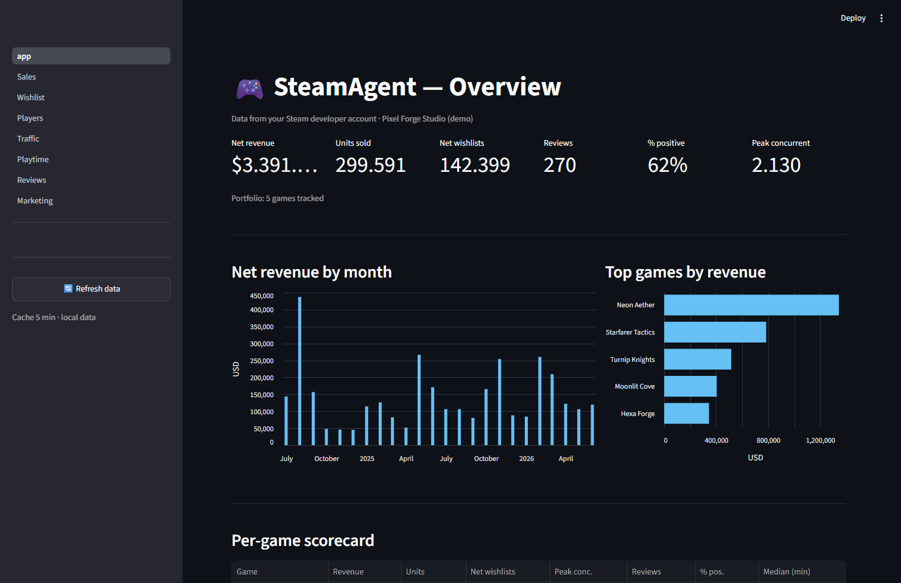
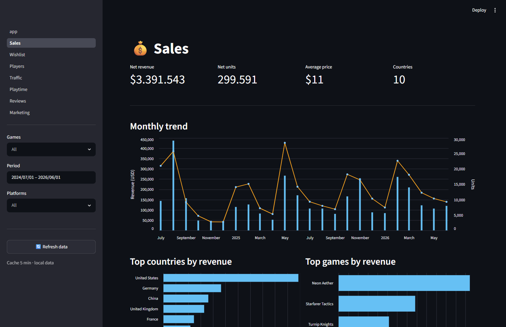
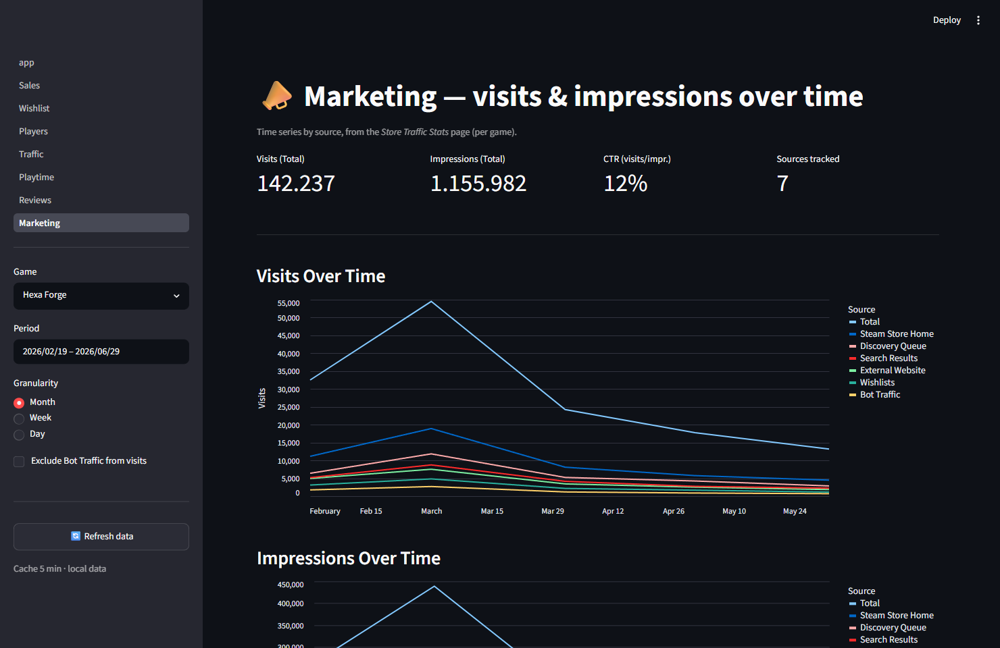

# SteamAgent

Automated collection of **all the data from your Steam developer/partner account**
— sales, wishlist, traffic, marketing, players, reviews, playtime —
with a visualization **dashboard** and a foundation for LLM processing.

Steam exposes little data via API: some can be downloaded as CSV from the partner
portals, while the rest must be read from the pages' HTML/JS. SteamAgent automates
login and collection and saves everything to a local database (SQLite, or Postgres in production).

[](https://github.com/FantasticoStudioDaniele/SteamAgent/actions/workflows/ci.yml)
[](LICENSE)

> Use **your** data from **your** partner portal: legitimate collection. No
> third-party scraping (e.g. SteamDB), gentle rate limits.

## Screenshots

Portfolio overview, per-game sales and marketing time-series — all rendered from the
bundled **demo dataset**, so you can try the whole dashboard without a Steam account
(see [Try the demo](#try-the-demo-no-account-needed)).



| Sales | Marketing |
|---|---|
|  |  |

## What it collects

| Dataset | Content |
|---|---|
| **Sales** | units + net revenue per product/country (monthly) |
| **Wishlist** | additions/removals/activations (daily) |
| **Marketing** | visits & impressions per source (full history) + ownership + top countries |
| **Players** | DAU + peak concurrent users (daily) |
| **Playtime** | mean/median time + lifetime distribution (snapshot) |
| **Reviews** | text + rating + language (public API) |
| **Traffic** | detailed breakdown of visits/impressions per source (daily) |

Plus a **Streamlit dashboard** with an overview and one page per dataset.

## Requirements

- Python ≥ 3.11
- [uv](https://docs.astral.sh/uv/)
- A **dedicated Steam bot account** (see [Prerequisite](#prerequisite-bot-account))

## Quickstart

```bash
git clone https://github.com/FantasticoStudioDaniele/SteamAgent.git && cd SteamAgent
uv sync                                  # creates .venv and installs dependencies
uv run playwright install chromium       # browser for the portal login

uv run steam-agent setup                 # wizard: credentials, login, partner, games, DB
uv run steam-agent collect-all           # downloads all data
uv run streamlit run dashboard/app.py    # dashboard at http://localhost:8501
```

The **`setup`** command is interactive: it asks for the bot credentials, opens the
browser for login (handling the email confirmation and the 2FA code), **auto-detects**
your `partner_id` and studio name, downloads the game list and initializes
the database. At any time, **`uv run steam-agent doctor`** checks that
all prerequisites are in place.

### Try the demo (no account needed)

No Steam partner account? Generate a synthetic dataset and explore the full dashboard —
your real DB and catalog are left untouched:

```bash
uv run python scripts/make_demo_db.py    # writes data/demo.db + config/games.demo.yaml (fake data)

# macOS / Linux
DATABASE_URL=sqlite:///data/demo.db STEAM_GAMES_PATH=config/games.demo.yaml \
  STUDIO_NAME="Pixel Forge Studio (demo)" \
  uv run streamlit run dashboard/app.py

# Windows (PowerShell)
$env:DATABASE_URL="sqlite:///data/demo.db"; $env:STEAM_GAMES_PATH="config/games.demo.yaml"; `
  $env:STUDIO_NAME="Pixel Forge Studio (demo)"; uv run streamlit run dashboard/app.py
```

## Prerequisite: bot account

1. Create a **dedicated Steam account** (not your personal one) and invite it into your
   Steamworks with **read-only report** permission (not admin). Keep the credentials isolated.
2. **2FA / Steam Guard** — two options:
   - **Simple (local):** configure nothing. On each `login`, enter the
     Steam Guard code by hand (from the mobile app or email).
   - **Automatic (unattended server):** extract the authenticator's `shared_secret`
     with [steamguard-cli](https://github.com/dyc3/steamguard-cli)
     or Steam Desktop Authenticator and put it in `STEAM_SHARED_SECRET`: login will use
     the TOTP, suitable for a scheduler.
3. *(optional)* a Steamworks **publisher Web API key** → `STEAM_PUBLISHER_API_KEY`.

> It's best to do the first login with a graphical interface (`setup` does this, or
> `login --headed`): Steam may ask for a "new device" confirmation via email.
> Afterwards, the session is saved in `data/storage_state.json` and subsequent logins
> are automatic.

## Commands

```bash
uv run steam-agent setup             # first-run wizard
uv run steam-agent doctor            # check prerequisites
uv run steam-agent collect-all       # update ALL datasets in sequence
uv run steam-agent login [--headed]  # login/session refresh only
uv run steam-agent collect-games     # update the game list (config/games.yaml)
uv run steam-agent init-db           # create/upgrade the DB schema (Alembic head)

# individual datasets:
uv run steam-agent collect-marketing # visits/impressions per source + ownership + countries
uv run steam-agent collect-wishlist
uv run steam-agent collect-sales [--since YYYY-MM] [--month YYYY-MM]
uv run steam-agent collect-players
uv run steam-agent collect-playtime
uv run steam-agent collect-reviews
uv run steam-agent collect-traffic [--day YYYY-MM-DD]
uv run steam-agent collect-public [--appid N]  # public-API snapshot (players/reviews/price), no login
uv run steam-agent show              # latest public snapshots
```

All collectors are **idempotent** (rerun them whenever you want). Marketing,
wishlist and players re-download the full history (one run = complete data); sales
update per-month; traffic per-day; reviews via upsert.

## Dashboard

```bash
uv run streamlit run dashboard/app.py
```

Multipage (`dashboard/pages/`), it reads the DB with the same engine as the collectors
(so it works with Postgres too). 5-min cache, **Refresh data** button.
Pages: **Overview · Sales · Wishlist · Players · Traffic · Playtime ·
Reviews · Marketing**.

## Configuration (`.env`)

| Variable | Required | Notes |
|---|---|---|
| `STEAM_USERNAME` / `STEAM_PASSWORD` | yes | dedicated bot account |
| `STEAM_SHARED_SECRET` | no | automatic login (TOTP); empty = manual code |
| `STEAM_PARTNER_ID` | for sales | auto-detected by `setup` |
| `STUDIO_NAME` | no | shown in dashboard; auto-detected |
| `ANTHROPIC_API_KEY` | no | LLM features (roadmap) |
| `DATABASE_URL` | no | defaults to SQLite; change here for Postgres |
| `STEAM_GAMES_PATH` | no | alternate games catalog (e.g. the demo); default `config/games.yaml` |
| `STEAM_PUBLISHER_API_KEY` | no | Steamworks Web API |

Copy `.env.example` to `.env`, or let `setup` handle it. The `.env`, the
session (`storage_state.json`) and the local data (`data/`) are in `.gitignore`:
they never end up in the repository.

## How it works (in brief)

- `src/steam_agent/auth/` — automatic login to the partner portals (Playwright + Steam Guard).
- `src/steam_agent/collectors/` — one module per dataset (CSV download or HTML/JS scraping).
- `src/steam_agent/storage/` — SQLAlchemy models, raw landing + typed warehouse.
  Schema versioned with **Alembic** (`migrations/`); the app runs `upgrade head`
  on startup, so updating SteamAgent never breaks an existing local database.
- `dashboard/` — Streamlit.

Steam has **two portals** with separate logins: `partner.steamgames.com` (new:
traffic, marketing) and `partner.steampowered.com` (old: sales, wishlist,
players, playtime). A single session covers both.

## Deploy (always-on server)

Cross-platform code. In production: switch to Postgres (`DATABASE_URL`), configure
`STEAM_SHARED_SECRET` for unattended login and schedule `collect-all`
(cron / systemd timer / Task Scheduler). The schema is created and kept up to date
automatically via Alembic on startup (or run `uv run alembic upgrade head`).

## Roadmap

- [x] Automatic auth to the two portals + game list
- [x] Collectors: sales, wishlist, marketing, players, playtime, reviews, traffic
- [x] Streamlit dashboard (overview + one page per dataset)
- [ ] LLM layer (insights, anomalies, review sentiment, natural-language Q&A → SQL)
- [ ] Scheduler, alerts, self-healing scrapers

## Security

Found a vulnerability? Please report it **privately** via GitHub's
[security advisories](https://github.com/FantasticoStudioDaniele/SteamAgent/security/advisories/new),
not a public issue — see [SECURITY.md](SECURITY.md).

The `shared_secret` (if you set it) generates Steam Guard codes forever, so it is
a **permanent 2FA bypass**: treat it like the account password, keep `.env` and
`data/storage_state.json` private (they are `chmod 0600` on POSIX), and run
`steam-agent doctor` to check the permissions.

## License

[MIT](LICENSE). Contributions welcome — see [CONTRIBUTING.md](CONTRIBUTING.md).

## Credits & support

Built by **Daniele Bianchini** at **[Fantastico Studio](https://fantasticostudio.it/)**,
developed entirely with **[Claude Code](https://claude.com/claude-code)** (Anthropic).

If you'd like to support us, check out our games and website: **https://fantasticostudio.it/** 🎮

## Legal notes

Collect **your** data from your partner portal: legitimate use. No third-party
scraping (e.g. SteamDB). Respect Steam's Terms and use gentle rate limits.
